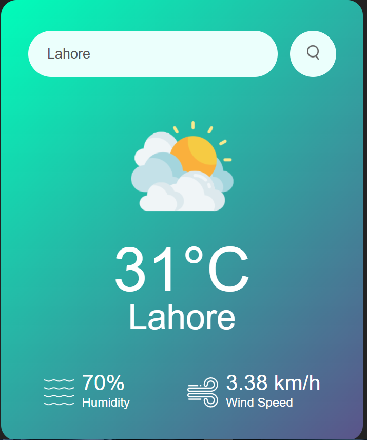

## 🌦️ Weather App

A simple and responsive weather application built with **HTML**, **CSS**, and **JavaScript**, using the **OpenWeatherMap API** to fetch real-time weather data for any city or town.

---

### 🚀 Features

* 🔍 Search weather by city name
* 🌡️ Displays temperature, humidity, wind speed, and condition
* 🎨 Clean and mobile-friendly UI
* ❌ Error handling for invalid or unknown locations
* 📸 Dynamic weather icons based on condition (e.g., rain, clear, clouds)

---

### 🖼️ Demo


---

### 📦 Tech Stack

* **HTML5**
* **CSS3**
* **JavaScript (Vanilla)**
* [OpenWeatherMap API](https://openweathermap.org/api)

---

### 🛠️ How to Use

1. **Clone the repo**

   ```bash
   git clone https://github.com/your-username/WeatherApp.git
   cd weather-app
   ```

2. **Open `index.html` in your browser**

3. **Replace the API key**
   In `script.js`, replace:

   ```js
   const apiKey = "YOUR_API_KEY";
   ```

   with your actual key from [OpenWeatherMap](https://openweathermap.org/appid).

---

### 🌍 Optional Enhancements

* Support for geolocation (get weather by current location)
* Support for coordinates (villages, small towns)
* Add toggle between °C / °F
* Save last searched city to `localStorage`

---

### 📄 License

This project is licensed under the MIT License — feel free to use and modify.

---
